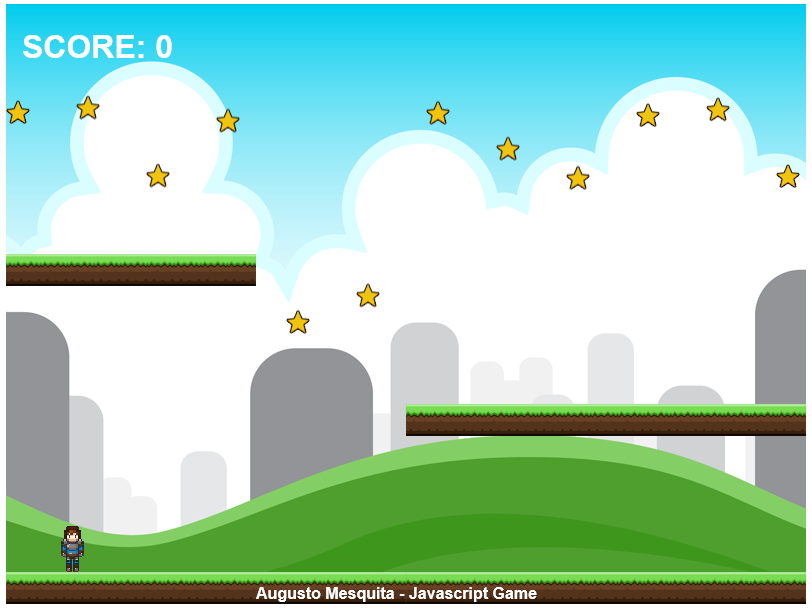


# Mini-game em Javascript
Mini-game criado utilizando Javascript com biblioteca Phaser 2 para realização de testes de conceito e ténicas.

## Colete as moedas
Você só precisa juntar as moedas da fase. Para reiniciar o game, recarregue a página.

O código está bem simples e comentado. É possível utilizá-lo como base para criação de seus jogos em javascript. Espero que gostem. Aproveitem!